# Employee Polls Project

In the final exercise of Udacity’s React Nanodegree, students build an interactive voting portal. Users can log in, post new polls, and vote on existing ones. The intuitive interface allows easy navigation between polls.

## Run the project

To run the project, you can follow these steps:

1. Clone or download the project to local repoitory
2. Make sure you node.js environment has been installed
3. Open terminal at the root of repository
4. Run command: `npm install` in order to install all the project's dependencies
5. Run command: `npm start` to start project. Press `F5` in VSCode to start the debug session
6. Run command: `npm test` to start the Unit Test process

## Setup project

### Clone the starter code project

Clone this [Starter code](https://github.com/udacity/nd0191-c2-React-Redux-project-starter). Basically, this code is initialized by the [Create React App](https://github.com/facebook/create-react-app) to bootstrap the project

### Command

```sh
npx create-react-app employee-polls
cd employee-polls
npm i @reduxjs/toolkit react-router-dom react-hook-form react-redux react-redux-loading-bar yup @hookform/resolvers
```

Install NextUI

```sh
npm i @nextui-org/react framer-motion
npm i -D tailwindcss
npx tailwindcss init
```

ESLint

```sh
npm i -g eslint
```

Jest

```sh
npm i --save-dev jest
```

Other package

```sh
npm i @react-stately/data
```

## Data

The `_DATA.js` file represents a fake database and methods that let you access the data.

There are two types of objects stored in our database:

- Users
- Questions

### Users

Users include:

| Attribute | Type   | Description                                                                                                                                                                                                    |
| --------- | ------ | -------------------------------------------------------------------------------------------------------------------------------------------------------------------------------------------------------------- |
| id        | String | The user’s unique identifier                                                                                                                                                                                   |
| password  | String | The user’s password in order to log in the application                                                                                                                                                         |
| name      | String | The user’s first name and last name                                                                                                                                                                            |
| avatarURL | String | The path to the image file                                                                                                                                                                                     |
| questions | Array  | A list of ids of the polling questions this user created                                                                                                                                                       |
| answers   | Object | The object's keys are the ids of each question this user answered. The value of each key is the answer the user selected. It can be either `'optionOne'` or `'optionTwo'` since each question has two options. |

### Questions

Questions include:

| Attribute | Type   | Description                            |
| --------- | ------ | -------------------------------------- |
| id        | String | The question’s unique identifier       |
| author    | String | The author’s unique identifier         |
| timestamp | String | The time when the question was created |
| optionOne | Object | The first voting option                |
| optionTwo | Object | The second voting option               |

### Voting Options

Voting options are attached to questions. They include:

| Attribute | Type   | Description                                                        |
| --------- | ------ | ------------------------------------------------------------------ |
| votes     | Array  | A list that contains the id of each user who voted for that option |
| text      | String | The text of the option                                             |

Your code will talk to the database via 4 methods:

- `_getUsers()`
- `_getQuestions()`
- `_saveQuestion(question)`
- `_saveQuestionAnswer(object)`

1. `_getUsers()` Method

_Description_: Get all of the existing users from the database.  
_Return Value_: Object where the key is the user’s id and the value is the user object.

2. `_getQuestions()` Method

_Description_: Get all of the existing questions from the database.  
_Return Value_: Object where the key is the question’s id and the value is the question object.

3. `_saveQuestion(question)` Method

_Description_: Save the polling question in the database. If one of the parameters are missing, an error is thrown.
_Parameters_: Object that includes the following properties: `author`, `optionOneText`, and `optionTwoText`. More details about these properties:

| Attribute     | Type   | Description                                |
| ------------- | ------ | ------------------------------------------ |
| author        | String | The id of the user who posted the question |
| optionOneText | String | The text of the first option               |
| optionTwoText | String | The text of the second option              |

_Return Value_: An object that has the following properties: `id`, `author`, `optionOne`, `optionTwo`, `timestamp`. More details about these properties:

| Attribute | Type   | Description                                                                                                                  |
| --------- | ------ | ---------------------------------------------------------------------------------------------------------------------------- |
| id        | String | The id of the question that was posted                                                                                       |
| author    | String | The id of the user who posted the question                                                                                   |
| optionOne | Object | The object has a text property and a votes property, which stores an array of the ids of the users who voted for that option |
| optionTwo | Object | The object has a text property and a votes property, which stores an array of the ids of the users who voted for that option |
| timestamp | String | The time when the question was created                                                                                       |

4. `_saveQuestionAnswer(object)` Method

_Description_: Save the answer to a particular polling question in the database. If one of the parameters are missing, an error is thrown.
_Parameters_: Object that contains the following properties: `authedUser`, `qid`, and `answer`. More details about these properties:

| Attribute  | Type   | Description                                                                             |
| ---------- | ------ | --------------------------------------------------------------------------------------- |
| authedUser | String | The id of the user who answered the question                                            |
| qid        | String | The id of the question that was answered                                                |
| answer     | String | The option the user selected. The value should be either `"optionOne"` or `"optionTwo"` |


## Screenshots

### Login Page

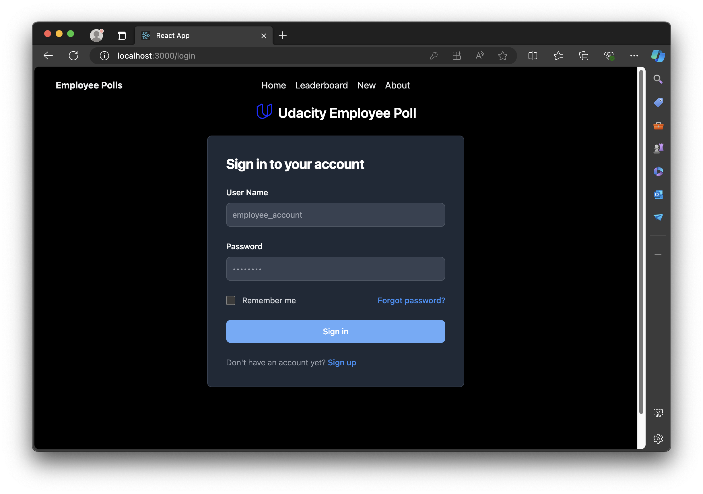

### Alert

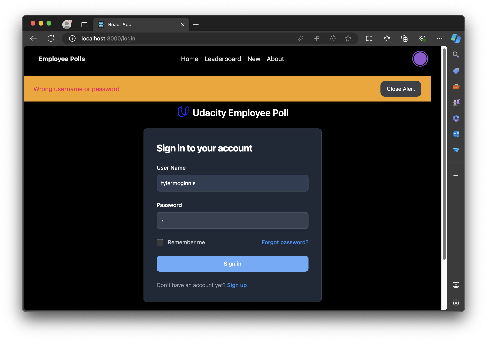

### Home

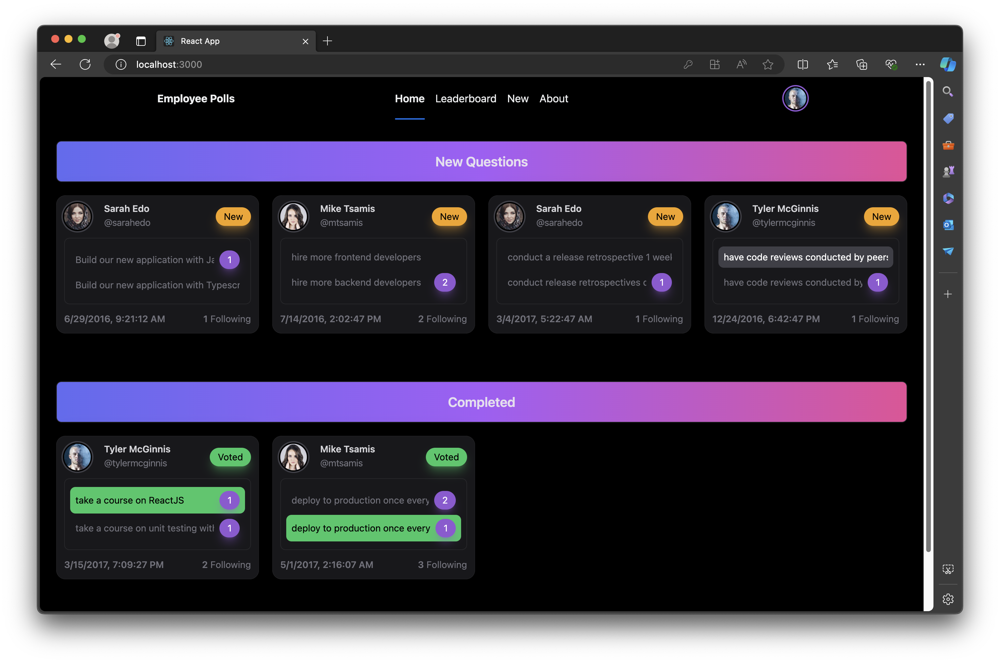

### Add

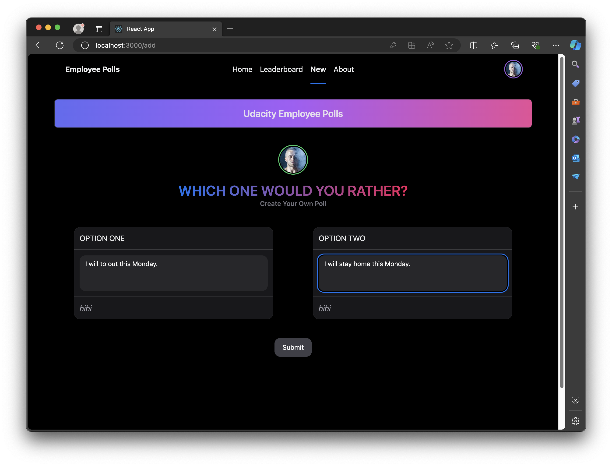

### Add result

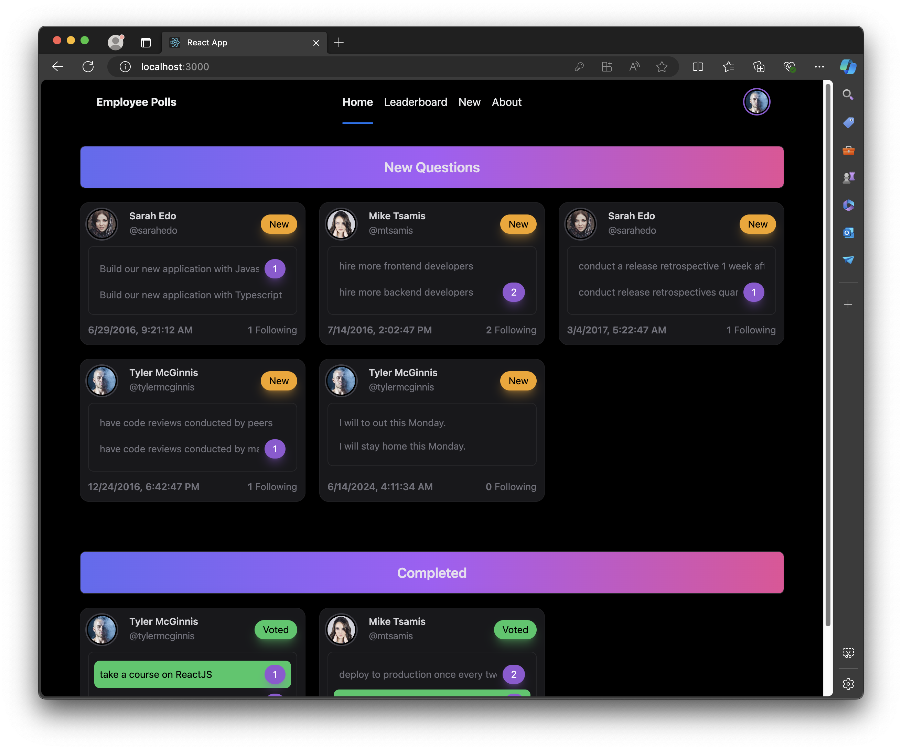

### Tooltip

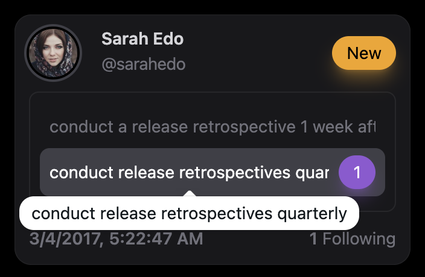

### Detail voted

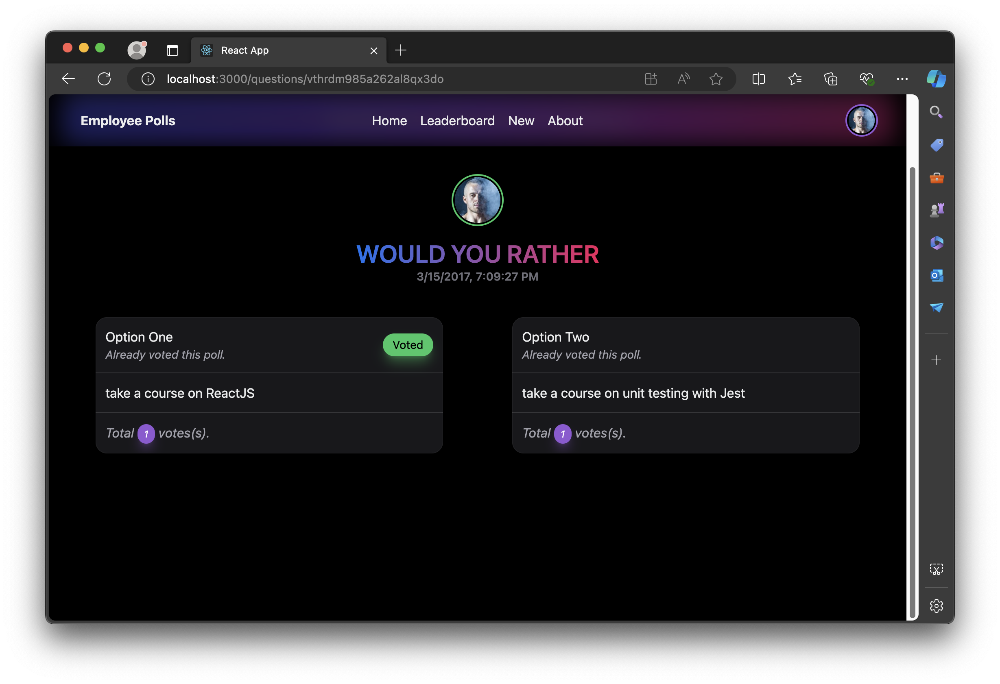

### detail unvoted

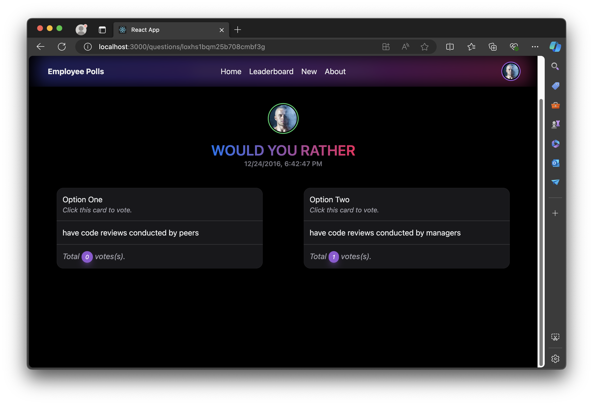

### After voted

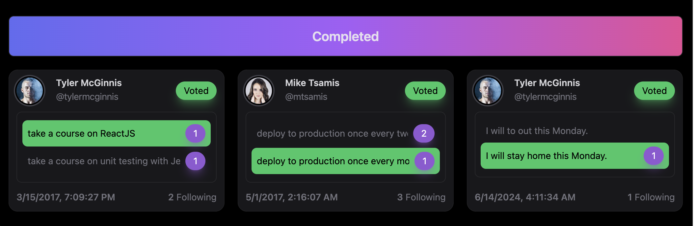

### Leaderboard

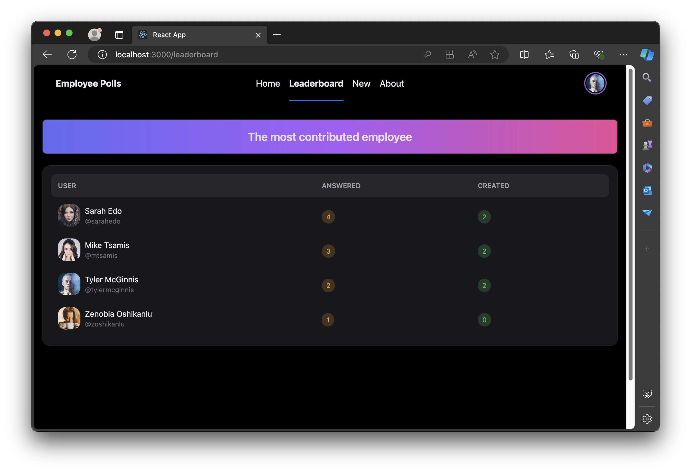

### Logout

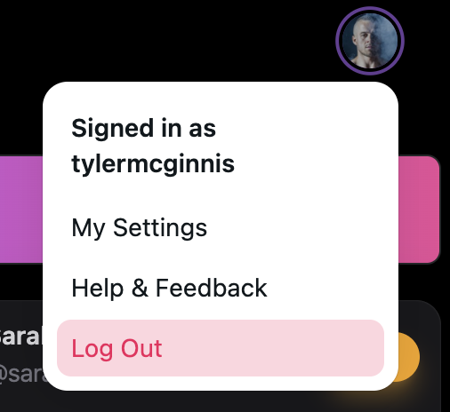

### 404

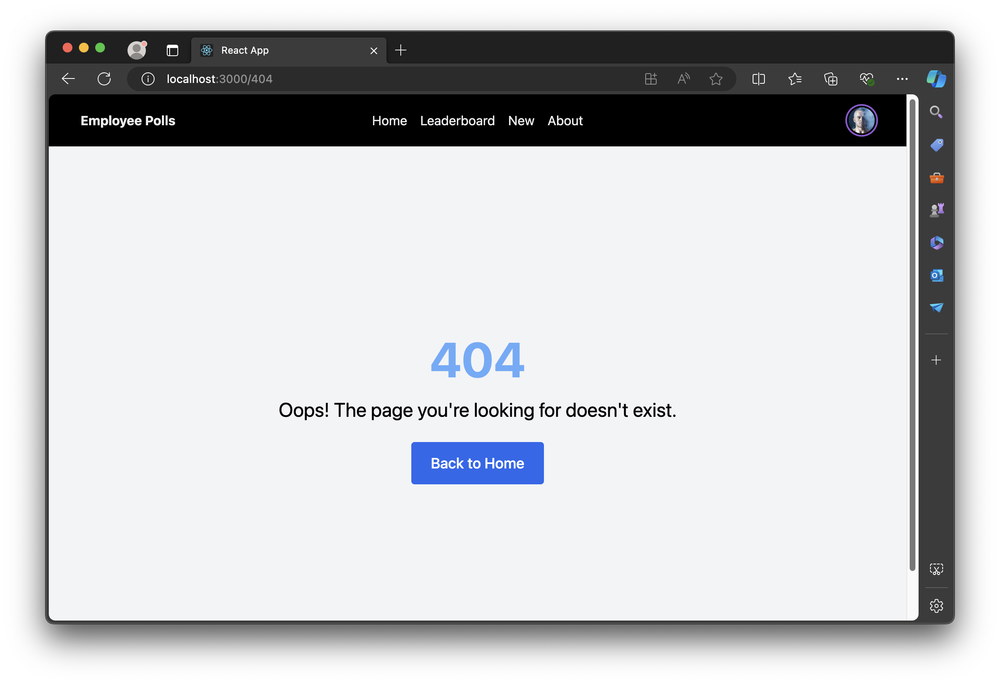

### Test result

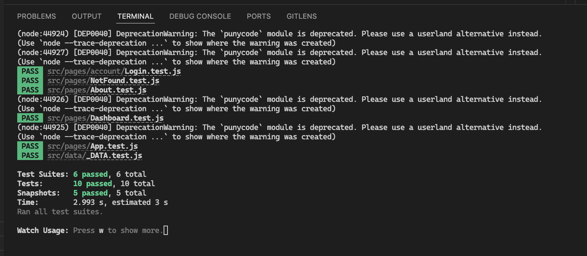
